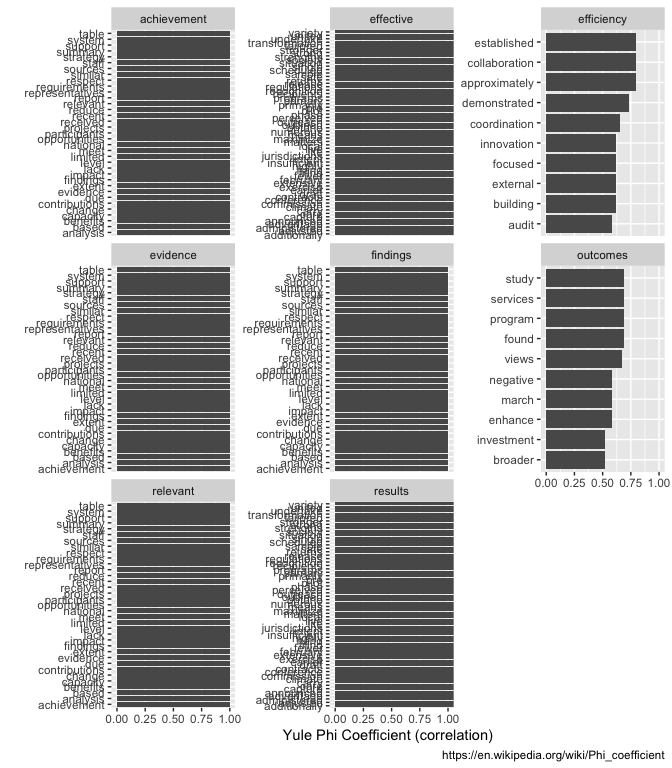
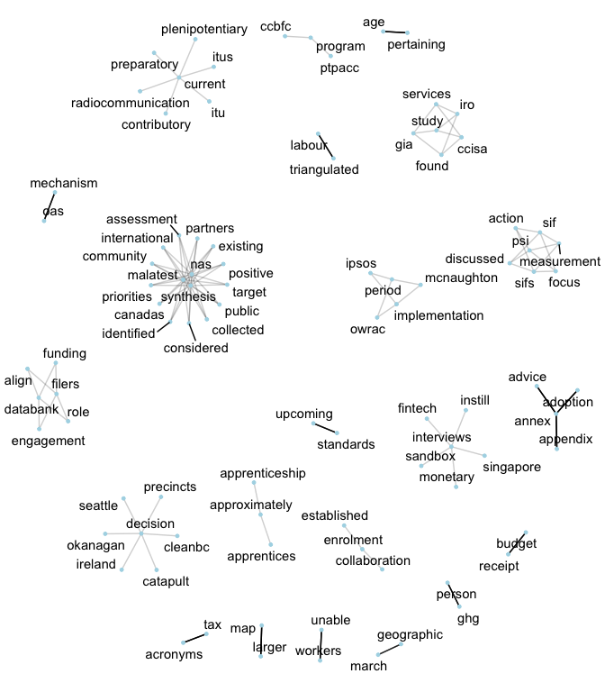
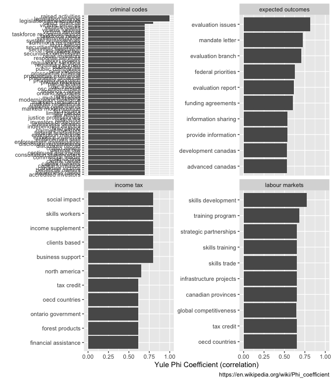
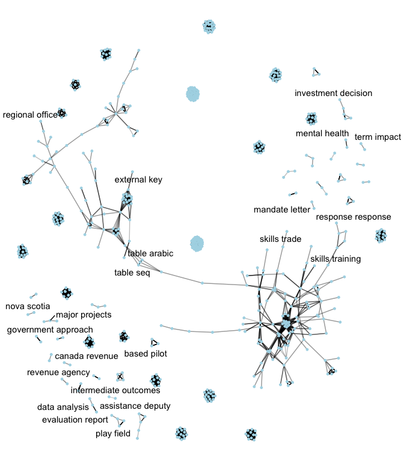
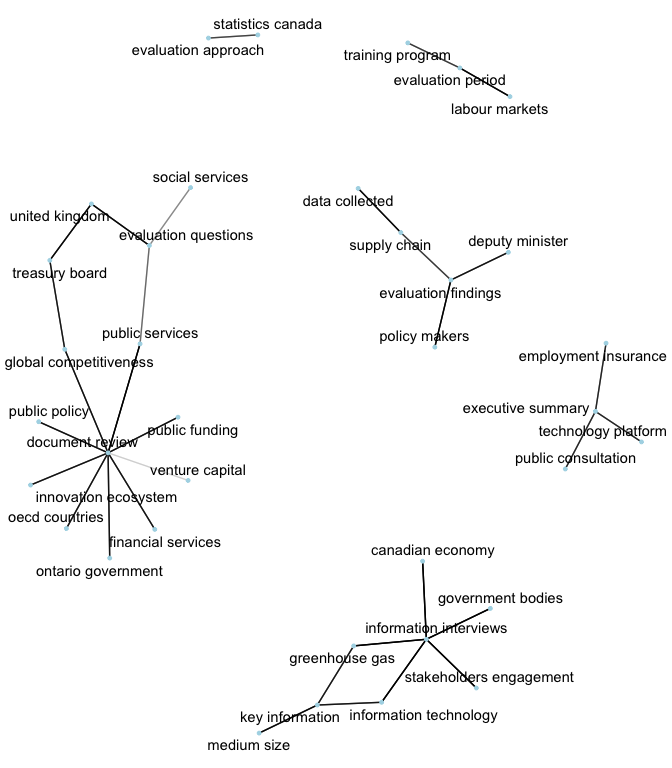
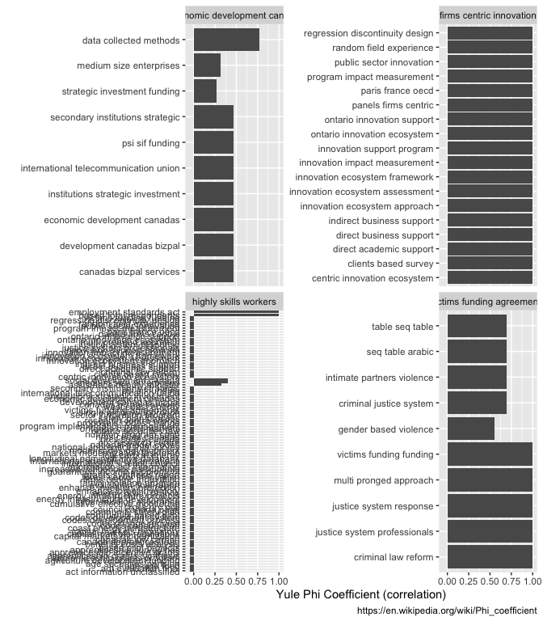
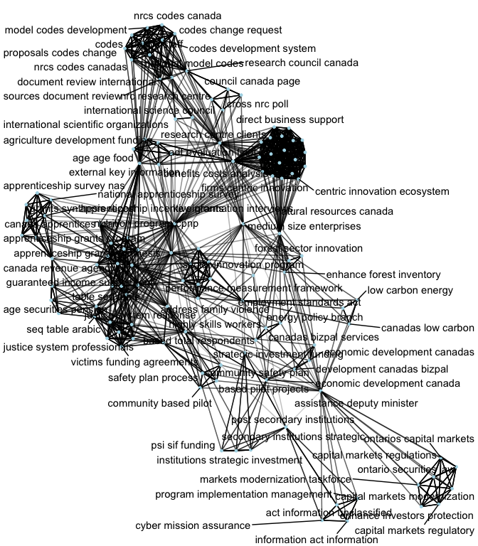
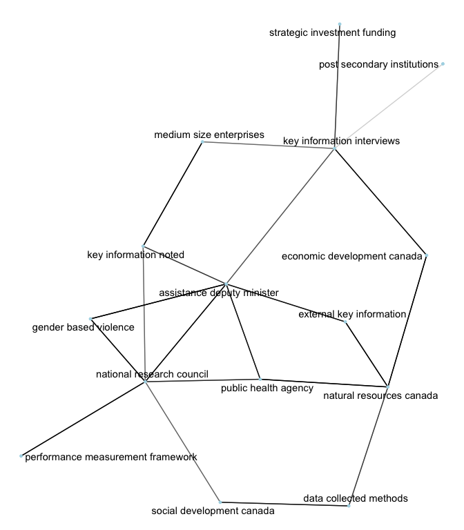

Document Text Processing
================
Peter Rabinovitch
2023-03-02 16:02:00

``` r
library(tidyverse)
library(tictoc)
library(lubridate)
library(knitr)
library(janitor)
library(tictoc)
library(ggthemes)
library(ggridges)
library(tidytext)
library(officer)
library(tidyr)
library(wordcloud)
library(pdftools)
library(stringi)
library(cleanNLP)
library(patchwork)
library(scales)

library(widyr)
library(igraph)
library(ggraph)
set.seed(2023)

g_fignum <- 0
figcap <- function() {
  g_fignum <<- g_fignum + 1
  return(str_c("Figure ", g_fignum))
}

g_tabnum <- 0
tabcap <- function() {
  g_tabnum <<- g_tabnum + 1
  return(str_c("Table ", g_tabnum))
}
```

# Intro

In this document we explore the value of two techniques: - correlation
of n-grams within a document, as described by [Yule’s Phi
Coefficient](https://en.wikipedia.org/wiki/Phi_coefficient), and - text
networks, where n-grams (nodes) are connected if their correlation is
high (low) enough.

Here we look at 1, 2 and 3-grams.

In summary, neither of these seem very usable in an automated context,
as they require fiddling with parameters to produce anything
inetersting, and the interesting artifacts they produce may not have any
practical importance.

# Data

Data here is loaded from the *output* of
[PrepDocs.R](https://github.com/prabinov42/DocStore/blob/main/PrepDocs.R),
typically called *tidydocs.csv*

``` r
df_grams <- read_csv("tidydocs.csv")
```

# 1 grams

Here potentially important 1-grams are plotted, each with other 1-grams
with which they have the highest correlation.

The potentially important 1-grams and their representatives (described
below) used were:  
- findings -\> findings  
- relevance -\> relevant  
- effectiveness -\> effective  
- efficiency -\> efficiency  
- outcomes -\> outcomes  
- evidence -\> evidence  
- achievement -\> achievement  
- results -\> results

Note that these words need to be mapped, via stemming, to the most
common representative that was used in the rest of the analysis, and
they map, for example, via the following code

``` r
dft %>% filter(stem_word==wordStem('relevance'))
# where dft is obtained from running the PrepDocs code.
```

## Correlation Plots

``` r
ngrams <- 1
word_cors <- df_grams %>%
  filter(ng == ngrams) %>%
  group_by(most_common_token) %>%
  filter(n() >= 10) %>%
  pairwise_cor(most_common_token, short_name, sort = TRUE)

mcg <- c( "relevant", "effective", "efficiency", "findings","outcomes", "evidence", "achievement","results")

word_cors %>%
  filter(item1 %in% mcg) %>%
  group_by(item1) %>%
  slice_max(correlation, n = 10) %>%
  ungroup() %>%
  mutate(item2 = reorder(item2, correlation)) %>%
  ggplot(aes(item2, correlation)) +
  geom_bar(stat = "identity") +
  facet_wrap(~item1, scales = "free_y") +
  coord_flip()+
  labs(y = "Yule Phi Coefficient (correlation)", x = '',caption='https://en.wikipedia.org/wiki/Phi_coefficient')
```

<!-- -->

Here we see that almost all documents mention *achievement*, *findings*,
etc and so these plots are not very useful.

## Text Networks

It may be possible to find interesting (maybe useful) clusters here, but
it would take considerable effort.

### Correlation

Here we plot only n-gram pairs that are highly correlated with each
other (correlation \>= 0.95).

``` r
word_cors %>%
  filter(correlation > .95) %>%
  graph_from_data_frame() %>%
  ggraph(layout = "fr") +
  geom_edge_link(aes(edge_alpha = correlation), show.legend = FALSE) +
  geom_node_point(color = "lightblue", size = 1) +
  geom_node_text(aes(label = name), repel = TRUE) +
  theme_void()
```

<!-- -->

### Anti-Correlation

Here we plot only n-gram pairs that are highly anti-correlated with each
other (correlation \<= -0.80).

``` r
word_cors %>%
  filter(correlation < -.8) %>%
  graph_from_data_frame() %>%
  ggraph(layout = "fr") +
  geom_edge_link(aes(edge_alpha = correlation), show.legend = FALSE) +
  geom_node_point(color = "lightblue", size = 1) +
  geom_node_text(aes(label = name), repel = TRUE) +
  theme_void()
```

<!-- -->

# 2 grams

## Correlation Plots

Here we do not find the 2-grams ‘relevance-findings’, or any of the
others as described above. It is likely that the tokens are in the
documents, just farther apart. A nice way to approach this problem is
potentially the subject of future work.

Hence, we illustrate with other, more representative tokens - but this
then becomes difficult to automate, and rather becomes more of an
exercise for an analyst to find interesting relationships.

``` r
ngrams <- 2
word_cors <- df_grams %>%
  filter(ng == ngrams) %>%
  group_by(most_common_token) %>%
  filter(n() >= 10) %>%
  pairwise_cor(most_common_token, short_name, sort = TRUE)

mcg <- c( "income tax", "criminal codes", "labour markets", "expected outcomes")
word_cors %>%
  filter(item1 %in% mcg) %>%
  group_by(item1) %>%
  slice_max(correlation, n = 10) %>%
  ungroup() %>%
  mutate(item2 = reorder(item2, correlation)) %>%
  ggplot(aes(item2, correlation)) +
  geom_bar(stat = "identity") +
  facet_wrap(~item1, scales = "free_y") +
  coord_flip()+
  labs(y = "Yule Phi Coefficient (correlation)", x = '',caption='https://en.wikipedia.org/wiki/Phi_coefficient')
```

<!-- -->

## Text Networks

### Correlation

Here we plot only n-gram pairs that are highly correlated with each
other (correlation \>= 0.75).

``` r
word_cors %>%
  filter(correlation > .75) %>%
  graph_from_data_frame() %>%
  ggraph(layout = "fr") +
  geom_edge_link(aes(edge_alpha = correlation), show.legend = FALSE) +
  geom_node_point(color = "lightblue", size = 1) +
  geom_node_text(aes(label = name), repel = TRUE) +
  theme_void()
```

<!-- -->

### Anti-Correlation

Here we plot only n-gram pairs that are highly anti-correlated with each
other (correlation \<= -0.60).

``` r
word_cors %>%
  filter(correlation <  -.60) %>%
  graph_from_data_frame() %>%
  ggraph(layout = "fr") +
  geom_edge_link(aes(edge_alpha = correlation), show.legend = FALSE) +
  geom_node_point(color = "lightblue", size = 1) +
  geom_node_text(aes(label = name), repel = TRUE) +
  theme_void()
```

<!-- -->

# 3 grams

Similar to 2-grams.

## Correlation Plots

``` r
ngrams <- 3
word_cors <- df_grams %>%
  filter(ng == ngrams) %>%
  group_by(most_common_token) %>%
  filter(n() >= 10) %>%
  pairwise_cor(most_common_token, short_name, sort = TRUE)

mcg <- c( "economic development canada", "highly skills workers", "victims funding agreements", "firms centric innovation")
word_cors %>%
  filter(item1 %in% mcg) %>%
  group_by(item1) %>%
  slice_max(correlation, n = 10) %>%
  ungroup() %>%
  mutate(item2 = reorder(item2, correlation)) %>%
  ggplot(aes(item2, correlation)) +
  geom_bar(stat = "identity") +
  facet_wrap(~item1, scales = "free_y") +
  coord_flip()+
  labs(y = "Yule Phi Coefficient (correlation)", x = '',caption='https://en.wikipedia.org/wiki/Phi_coefficient')
```

<!-- -->

## Text Networks

## Correlation

Here we plot only n-gram pairs that are correlated with each other
(correlation \>= 0). It makes for an interesting picture, but the
practical value of this image is questionable.

``` r
word_cors %>%
  filter(correlation > 0) %>%
  graph_from_data_frame() %>%
  ggraph(layout = "fr") +
  geom_edge_link(aes(edge_alpha = correlation), show.legend = FALSE) +
  geom_node_point(color = "lightblue", size = 1) +
  geom_node_text(aes(label = name), repel = TRUE) +
  theme_void()
```

<!-- -->

### Anti-Correlation

Here we plot only n-gram pairs that are highly anti-correlated with each
other (correlation \<= -0.25).

``` r
word_cors %>%
  filter(correlation < -.25) %>%
  graph_from_data_frame() %>%
  ggraph(layout = "fr") +
  geom_edge_link(aes(edge_alpha = correlation), show.legend = FALSE) +
  geom_node_point(color = "lightblue", size = 1) +
  geom_node_text(aes(label = name), repel = TRUE) +
  theme_void()
```

<!-- -->

# Appendices

<details>
<summary>
References
</summary>

[Tidy Text Mining in R](https://www.tidytextmining.com)

</details>
<details>
<summary>
SessionInfo
</summary>

``` r
sessionInfo()
```

    ## R version 4.2.2 (2022-10-31)
    ## Platform: x86_64-apple-darwin17.0 (64-bit)
    ## Running under: macOS Big Sur ... 10.16
    ## 
    ## Matrix products: default
    ## BLAS:   /Library/Frameworks/R.framework/Versions/4.2/Resources/lib/libRblas.0.dylib
    ## LAPACK: /Library/Frameworks/R.framework/Versions/4.2/Resources/lib/libRlapack.dylib
    ## 
    ## locale:
    ## [1] en_US.UTF-8/en_US.UTF-8/en_US.UTF-8/C/en_US.UTF-8/en_US.UTF-8
    ## 
    ## attached base packages:
    ## [1] stats     graphics  grDevices utils     datasets  methods   base     
    ## 
    ## other attached packages:
    ##  [1] ggraph_2.1.0       igraph_1.4.1       widyr_0.1.5        scales_1.2.1      
    ##  [5] patchwork_1.1.2    cleanNLP_3.0.4     stringi_1.7.8      pdftools_3.3.2    
    ##  [9] wordcloud_2.6      RColorBrewer_1.1-3 officer_0.6.0      tidytext_0.4.1    
    ## [13] ggridges_0.5.4     ggthemes_4.2.4     janitor_2.2.0      knitr_1.41        
    ## [17] tictoc_1.1         lubridate_1.9.2    forcats_1.0.0      stringr_1.5.0     
    ## [21] dplyr_1.1.0        purrr_1.0.1        readr_2.1.4        tidyr_1.3.0       
    ## [25] tibble_3.1.8       ggplot2_3.4.1      tidyverse_2.0.0   
    ## 
    ## loaded via a namespace (and not attached):
    ##  [1] bit64_4.0.5        SnowballC_0.7.0    tools_4.2.2        backports_1.4.1   
    ##  [5] utf8_1.2.2         R6_2.5.1           colorspace_2.0-3   withr_2.5.0       
    ##  [9] tidyselect_1.2.0   gridExtra_2.3      bit_4.0.5          compiler_4.2.2    
    ## [13] cli_3.6.0          xml2_1.3.3         labeling_0.4.2     askpass_1.1       
    ## [17] digest_0.6.31      rmarkdown_2.19     pkgconfig_2.0.3    htmltools_0.5.4   
    ## [21] highr_0.10         fastmap_1.1.0      rlang_1.0.6        rstudioapi_0.14   
    ## [25] farver_2.1.1       generics_0.1.3     vroom_1.6.0        zip_2.2.2         
    ## [29] tokenizers_0.3.0   magrittr_2.0.3     Matrix_1.5-3       Rcpp_1.0.9        
    ## [33] munsell_0.5.0      fansi_1.0.3        viridis_0.6.2      lifecycle_1.0.3   
    ## [37] yaml_2.3.6         snakecase_0.11.0   MASS_7.3-58.1      plyr_1.8.8        
    ## [41] grid_4.2.2         parallel_4.2.2     ggrepel_0.9.2      crayon_1.5.2      
    ## [45] lattice_0.20-45    graphlayouts_0.8.4 hms_1.1.2          pillar_1.8.1      
    ## [49] uuid_1.1-0         reshape2_1.4.4     glue_1.6.2         evaluate_0.19     
    ## [53] qpdf_1.3.0         vctrs_0.5.2        tzdb_0.3.0         tweenr_2.0.2      
    ## [57] gtable_0.3.1       openssl_2.0.5      polyclip_1.10-4    xfun_0.36         
    ## [61] ggforce_0.4.1      broom_1.0.3        tidygraph_1.2.2    janeaustenr_1.0.0 
    ## [65] viridisLite_0.4.1  timechange_0.1.1   ellipsis_0.3.2

</details>
