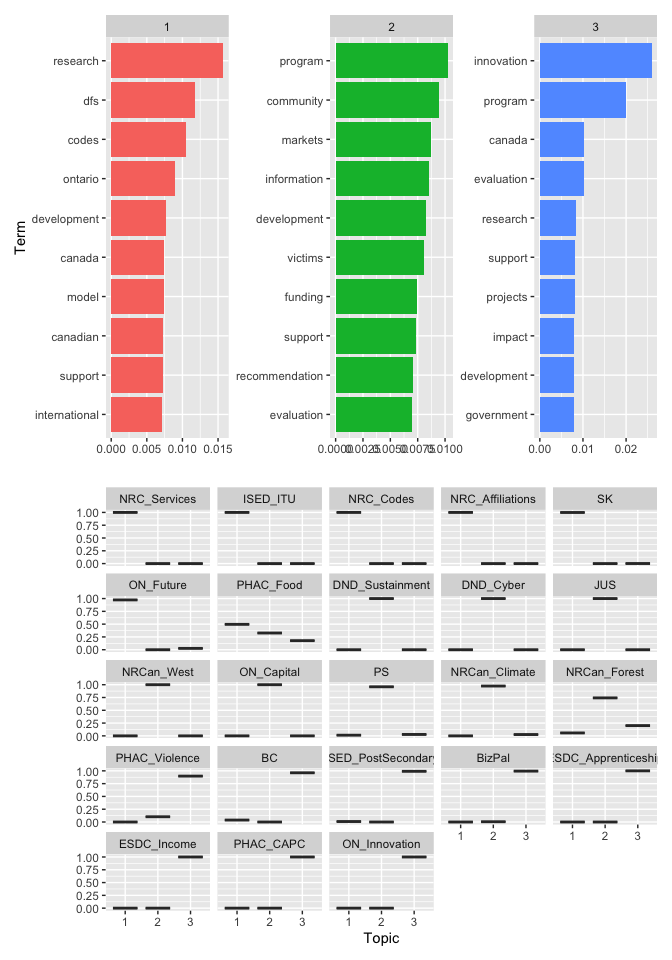
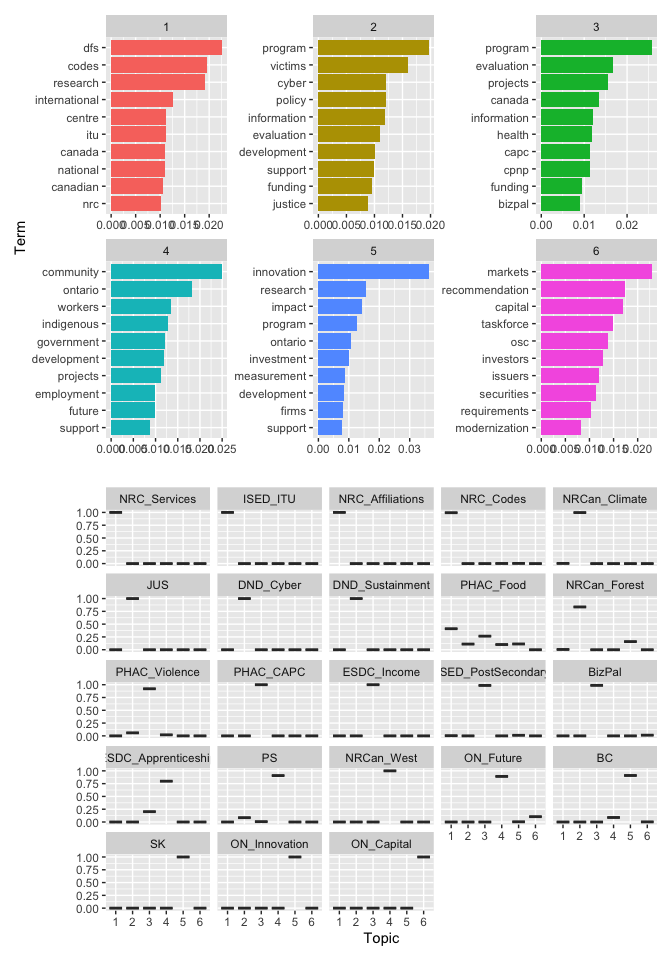

Document Text Processing: Topic Models
================
Peter Rabinovitch
2023-03-08 14:25:35

``` r
library(tidyverse)
library(tidytext)
library(topicmodels)
library(ggthemes)
library(patchwork)

set.seed(2023)

g_fignum <- 0
figcap <- function() {
  g_fignum <<- g_fignum + 1
  return(str_c("Figure ", g_fignum))
}

g_tabnum <- 0
tabcap <- function() {
  g_tabnum <<- g_tabnum + 1
  return(str_c("Table ", g_tabnum))
}
```

# Intro

In this document we explore the value of the LDA [Latent Dirichelet
Allocation](https://en.wikipedia.org/wiki/Latent_Dirichlet_allocation)
topic model.  
Here we look only at 1-grams.

It is likely that this test corpus of 23 documents is too small to see
any real value in the technique, as most documents fall into a single
topic. Hence, it may be worthwhile to repeat this approach with a larger
corpus of documents, and varying the parameters (primarily number of
topics) to assess its value.

# Data

Data here is loaded from the *output* of
[PrepDocs.R](https://github.com/prabinov42/DocStore/blob/main/PrepDocs.R),
typically called *tidydocs.csv*

``` r
df_grams <- read_csv("tidydocs.csv")
```

# Models

There are two parameters we need to specify:  
- the number of topics we expect in the corpus, denoted *n_topics*,
and  
- the number of words we show for each topic in the plots, denoted
*n_words*.

## 3 topics, 10 words

``` r
ngrams <- 1
n_topics <- 3
n_words <- 10

grams_dtm <- df_grams %>%
  filter(ng == ngrams) %>%
  count(short_name, most_common_token) %>%
  cast_dtm(short_name, most_common_token, n)

grams_lda <- LDA(grams_dtm, k = n_topics, control = list(seed = 2023))

grams_topics <- tidy(grams_lda, matrix = "beta")

top_terms <- grams_topics %>%
  group_by(topic) %>%
  slice_max(beta, n = n_words) %>%
  ungroup() %>%
  arrange(topic, -beta)

p1<-top_terms %>%
  mutate(term = reorder_within(term, beta, topic)) %>%
  ggplot(aes(beta, term, fill = factor(topic))) +
  geom_col(show.legend = FALSE) +
  facet_wrap(~topic, scales = "free") +
  scale_y_reordered()+
  labs(x='', y = "Term")

grams_gamma <- tidy(grams_lda, matrix = "gamma")

p2<-grams_gamma %>%
  mutate(title = reorder(document, gamma * topic)) %>%
  ggplot(aes(factor(topic), gamma)) +
  geom_boxplot() +
  facet_wrap(~title) +
  labs(x = "Topic", y = '')


p1/p2
```

<!-- -->

The way to read the above plot is as follows:  
- the top plot shows three different topics (1, 2 & 3), and for each
lists the 10 most likely words for each of the topics. As an example,
topic 1 is most likely to use the word *research*, and next most likely
to use the word *dfs* (whatever that means!). On the other hand, topic 3
is most likely to use *innovation*, and next most likely to use
*program*. Of course, the same word can be used in multiple topics, like
*development*. But the selected words, and the likelihood of each gives
a sense of what that topic is about.  
- the second plot (actually a boxplot, but the results are so
concentrated that rather than a box the results appear as a line) says
that, for example, the document *NRC_Services* discusses almost entirely
topic 1, where as the document *ON_Innovation* discusses almost entirely
topic 3. And, *PHAC_Food* discusses a mixture of topics 1,2 and 3 with
topic 1 most heavily weighted and topic 3 the least.

## 6 topics, 10 words

``` r
ngrams <- 1
n_topics <- 6
n_words <- 10

grams_dtm <- df_grams %>%
  filter(ng == ngrams) %>%
  count(short_name, most_common_token) %>%
  cast_dtm(short_name, most_common_token, n)

grams_lda <- LDA(grams_dtm, k = n_topics, control = list(seed = 2023))

grams_topics <- tidy(grams_lda, matrix = "beta")

top_terms <- grams_topics %>%
  group_by(topic) %>%
  slice_max(beta, n = n_words) %>%
  ungroup() %>%
  arrange(topic, -beta)

p1<-top_terms %>%
  mutate(term = reorder_within(term, beta, topic)) %>%
  ggplot(aes(beta, term, fill = factor(topic))) +
  geom_col(show.legend = FALSE) +
  facet_wrap(~topic, scales = "free") +
  scale_y_reordered()+  
  labs(x='', y = "Term")

grams_gamma <- tidy(grams_lda, matrix = "gamma")

p2<-grams_gamma %>%
  mutate(title = reorder(document, gamma * topic)) %>%
  ggplot(aes(factor(topic), gamma)) +
  geom_boxplot() +
  facet_wrap(~title) +
  labs(x = "Topic", y = '')

p1/p2
```

<!-- -->

The interpretation of this plot is similar to the above.

# Appendices

<details>
<summary>
References
</summary>

[Tidy Text Mining in R](https://www.tidytextmining.com)

</details>
<details>
<summary>
SessionInfo
</summary>

``` r
sessionInfo()
```

    ## R version 4.2.2 (2022-10-31)
    ## Platform: x86_64-apple-darwin17.0 (64-bit)
    ## Running under: macOS Big Sur ... 10.16
    ## 
    ## Matrix products: default
    ## BLAS:   /Library/Frameworks/R.framework/Versions/4.2/Resources/lib/libRblas.0.dylib
    ## LAPACK: /Library/Frameworks/R.framework/Versions/4.2/Resources/lib/libRlapack.dylib
    ## 
    ## locale:
    ## [1] en_US.UTF-8/en_US.UTF-8/en_US.UTF-8/C/en_US.UTF-8/en_US.UTF-8
    ## 
    ## attached base packages:
    ## [1] stats     graphics  grDevices utils     datasets  methods   base     
    ## 
    ## other attached packages:
    ##  [1] patchwork_1.1.2    ggthemes_4.2.4     topicmodels_0.2-13 tidytext_0.4.1    
    ##  [5] lubridate_1.9.2    forcats_1.0.0      stringr_1.5.0      dplyr_1.1.0       
    ##  [9] purrr_1.0.1        readr_2.1.4        tidyr_1.3.0        tibble_3.1.8      
    ## [13] ggplot2_3.4.1      tidyverse_2.0.0   
    ## 
    ## loaded via a namespace (and not attached):
    ##  [1] Rcpp_1.0.9        lattice_0.20-45   digest_0.6.31     utf8_1.2.2       
    ##  [5] slam_0.1-50       R6_2.5.1          plyr_1.8.8        stats4_4.2.2     
    ##  [9] evaluate_0.19     highr_0.10        pillar_1.8.1      rlang_1.0.6      
    ## [13] rstudioapi_0.14   Matrix_1.5-3      rmarkdown_2.19    labeling_0.4.2   
    ## [17] bit_4.0.5         munsell_0.5.0     compiler_4.2.2    janeaustenr_1.0.0
    ## [21] xfun_0.36         pkgconfig_2.0.3   htmltools_0.5.4   tidyselect_1.2.0 
    ## [25] fansi_1.0.3       crayon_1.5.2      tzdb_0.3.0        withr_2.5.0      
    ## [29] SnowballC_0.7.0   grid_4.2.2        gtable_0.3.1      lifecycle_1.0.3  
    ## [33] magrittr_2.0.3    scales_1.2.1      tokenizers_0.3.0  cli_3.6.0        
    ## [37] stringi_1.7.8     vroom_1.6.0       farver_2.1.1      reshape2_1.4.4   
    ## [41] NLP_0.2-1         xml2_1.3.3        ellipsis_0.3.2    generics_0.1.3   
    ## [45] vctrs_0.5.2       tools_4.2.2       bit64_4.0.5       glue_1.6.2       
    ## [49] hms_1.1.2         parallel_4.2.2    fastmap_1.1.0     yaml_2.3.6       
    ## [53] timechange_0.1.1  tm_0.7-8          colorspace_2.0-3  knitr_1.41       
    ## [57] modeltools_0.2-23

</details>
